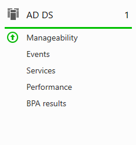
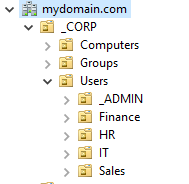
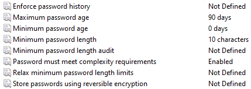
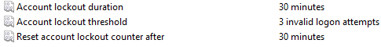
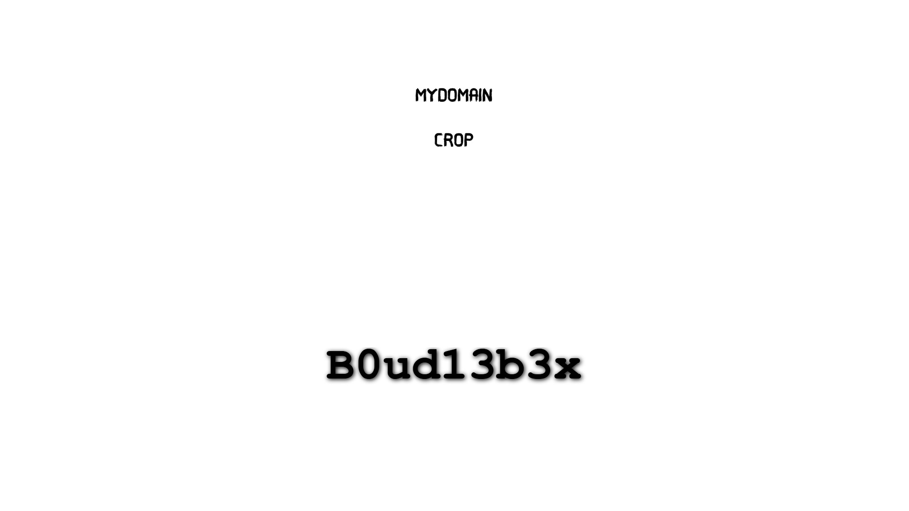
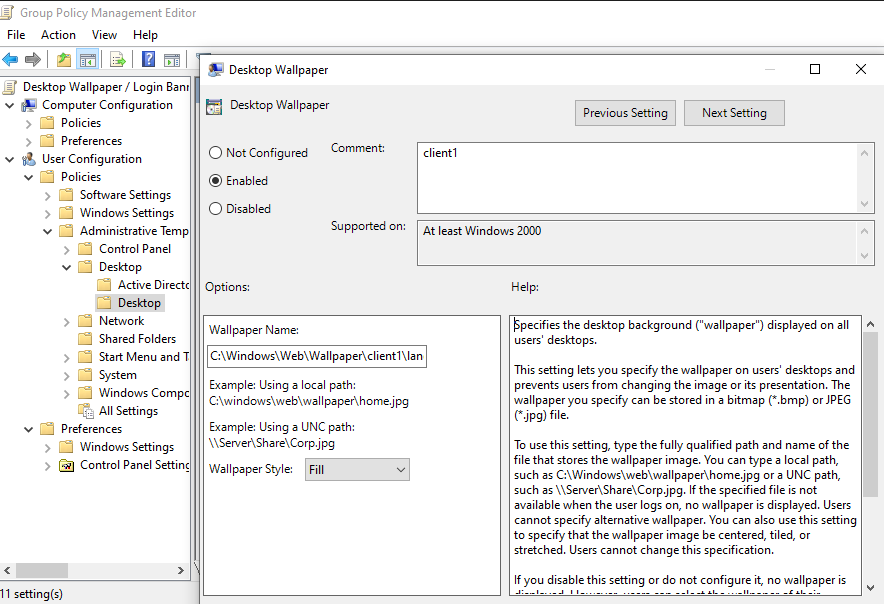
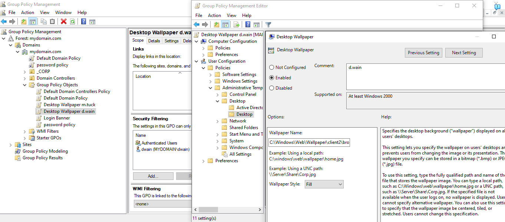
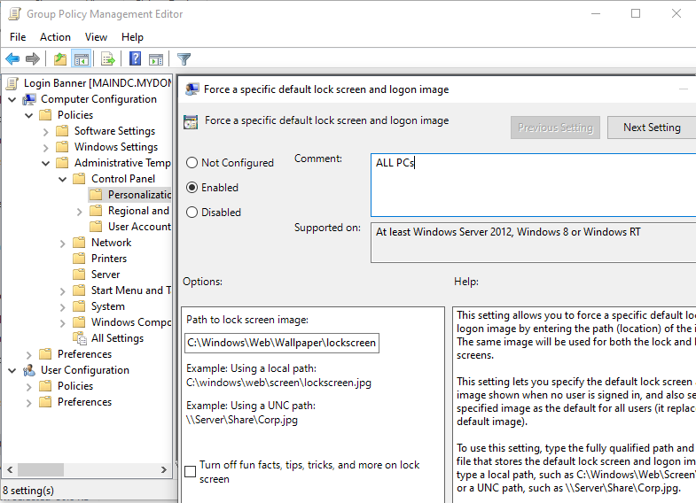
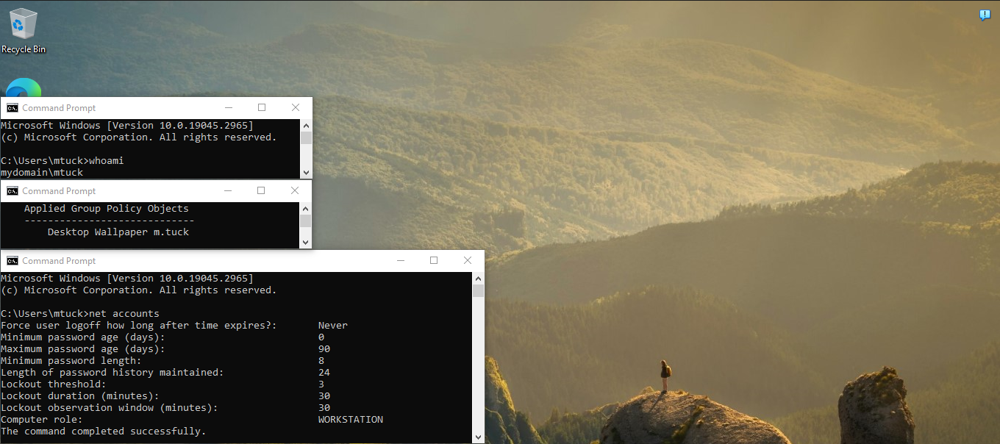
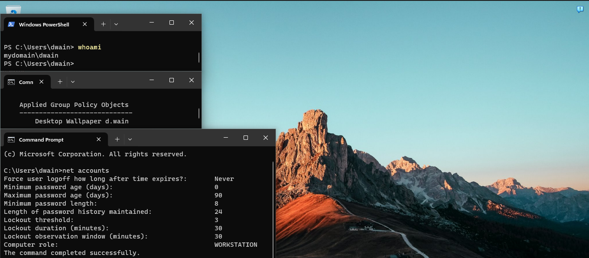

# Active Directory Domain Services (AD DS)

This section documents how I designed and configured the identity
and access management layer of the lab using Active Directory.
 
---
 
## What is AD DS and Why It Matters
 
Active Directory Domain Services is the backbone of identity management
in virtually every enterprise Windows environment. It controls:
- Who can log in and to which machines
- What resources each user can access
- What policies apply to each department
- How users are organized across the company
 
In this lab, `mydomain.com` acts as a simulated corporate forest
with realistic department structure and security policies.

---

## Step 1 - Installing AD DS on the Server

**Installation steps:**
1. Server Manager → Add Roles and Features
2. Role: **Active Directory Domain Services**
3. After install → click the flag notification → **Promote this server to a domain controller**
4. Selected: **Add a new forest**
5. Root domain name: `mydomain.com`
6. Set DSRM password → completed the wizard → server restarted

After the server restarted it automatically logged in under the domain.
The login screen now showed mydomain\Administrator instead of just Administrator.
Server Manager also updated to show AD DS and DNS both installed and running.

**Screenshot : Server Manager showing AD DS role installed:**



---

## Step 2 - Designing the Organizational Unit (OU) Structure

Rather than dumping all users into the default Users container,
I designed a proper OU hierarchy that mirrors a real company structure.
This matters because GPOs are applied at the OU level. Good OU design
means precise control over who gets what policy.

**OU Structure:**

```
mydomain.com
└── _CORP                        ← Top-level OU (custom, not default)
     ├── Computers
     ├── Goups
     └── Users
          ├── _ADMIN               ← Separated admin accounts from regular users
          ├── HR
          ├── Sales
          ├── Finance 
          └── IT                 
```

**Why I put users in `_CORP` instead of the default container:**

The default 'Users' container in AD can't have GPOs applied directly to it.
By creating a custom OU structure under _CORP, I can apply department-specific
policies to exactly the right group of users. For example, a stricter
password policy for Finance than for Sales.

**Steps to create OUs:**
1. Tools → Active Directory Users and Computers
2. Right-click `mydomain.com` → New → Organizational Unit
3. Named it `_CORP` (underscore keeps it at the top of the list)
4. Inside `_CORP` → created Users, Goups, Computers OUs
5. Inside `Users` → created IT, HR, Sales, Finance, _ADMIN OUs
**Screenshot : OU hierarchy in AD Users and Computers:**



---

## Step 3 - Group Policy Objects (GPOs)

Group Policy allows me to enforce security settings and configurations
across all machines in the domain automatically . (no manual setup per machine.)

### GPO 1 - Password Policy

| Setting | Value | Reason |
|---|---|---|
| Minimum Password Length | 10 characters | Industry baseline |
| Maximum Password Age | 90 days | Forces regular rotation |
| Password Complexity | Enabled | Requires mixed characters |
| Account Lockout Threshold | 3 failed attempts | Protects against brute force |
| Lockout Duration | 30 minutes | Auto-unlocks after 30 min |
| Observation Window | 30 minutes | Resets counter after 30 min |


I edited the Default Domain Policy to apply the password rules domain-wide.
For the lockout policy I had to go into Account Policies → Account Lockout Policy
separately  it's a common mistake to look for it inside Password Policy.

**Screenshot : GPO Editor showing password policy settings:**



**Screenshot : GPO Editor showing account lockout settings:**



### GPO 2 - Desktop Wallpaper / Login Banner 
Setting up Desktop Wallpapers for users + Login Banner for client 1 (win10) and client 2 (win11) as follows:

Wallpaper for m.tuck (from finance) it should be :


Wallpaper for d.wain (from HR) it should be :


Login Banner for client 1 and 2 (Windows/device) it should be :




**Screenshots : GPO Editor showing Desktop Wallpaper settings:**

 for m.tuck (from finance)
 


 for d.wain (from HR)
 


**Screenshot : GPO Editor showing Login Banner settings:**



### verifying if the GPOs worked

**m.tuck's Wallpaper**


**d.wain's Wallpaper**


**Windows 10 and 11 login Banner:**
windows 10


windows 11


---

## Step 4 - User Management

### Manual User Creation

**Steps to create a user manually:**
1. AD Users and Computers → expand the domain → navigate to the right OU
2. Right-click the OU → New → User
3. Fill in: First name, Last name, User logon name
4. Set initial password → check "User must change password at next logon"
5. Click Finish


I created an IT admin account called 'a-mboudieb' in the _ADMIN OU
separate from my regular user account. This follows the least-privilege
principle. The admin account is only used when admin rights are actually needed.

**Screenshot : New user creation dialog:**


### Bulk User Creation (via PowerShell)

For scale testing, I created 1,000+ users automatically using a PowerShell script.
See the full documentation in [powershell-automation](../powershell-automation/README.md).

**Screenshot : AD Users and Computers showing bulk-created users:**


---

## Key Concepts Demonstrated

- **Least privilege** : users are placed in department OUs and only receive permissions relevant to their role
- **Security baseline via GPO** : password complexity and lockout enforced domain-wide automatically
- **OU design** : structure reflects real enterprise organization, enabling precise policy targeting
- **Separation of admin accounts** : administrative users live in `_ADMIN`, separate from standard users
