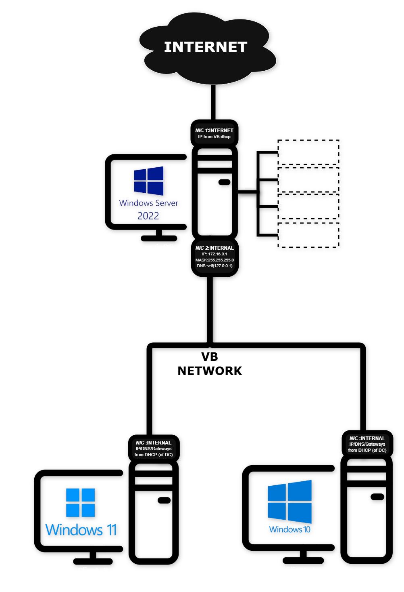
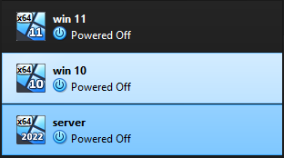
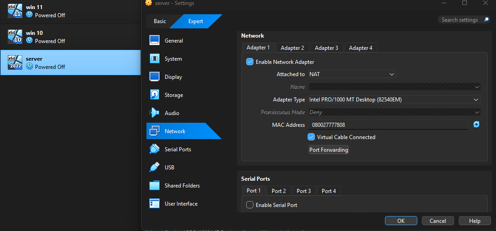
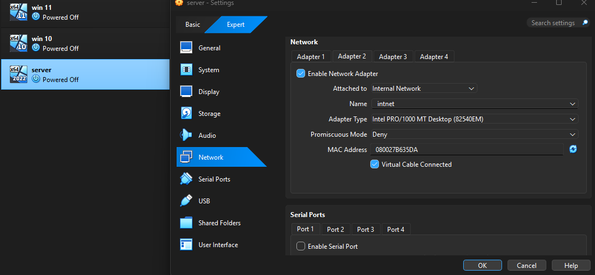
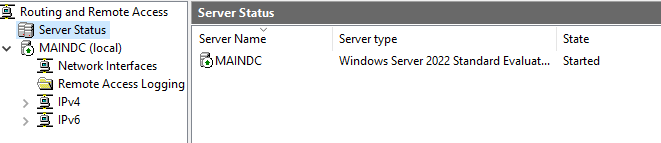
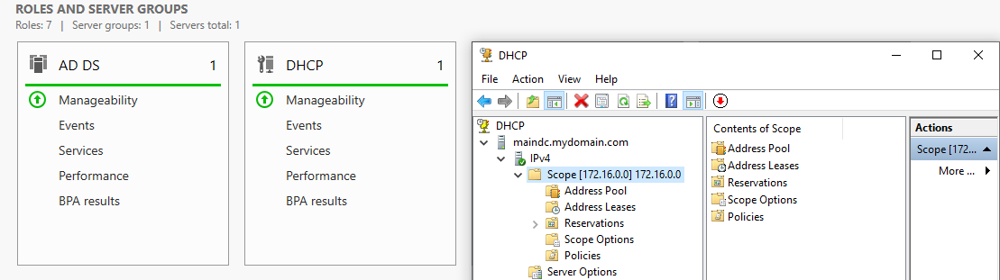
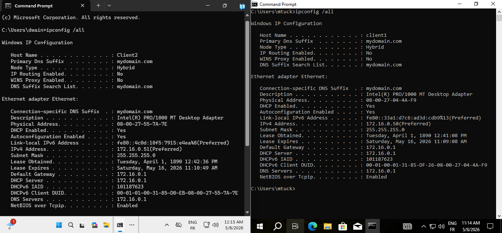
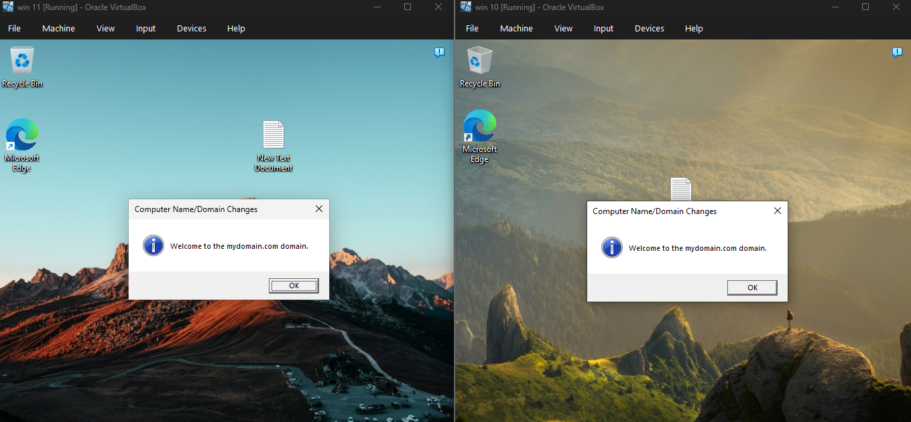

# Network Infrastructure Setup

This section documents how I built the physical foundation of the lab:
the virtual machines, network adapters, and routing that everything else runs on.

---

## Environment Specs

| Component | Details |
|---|---|
| Hypervisor | Oracle VirtualBox |
| Domain Controller OS | Windows Server 2022 |
| Client 1 | Windows 10 Pro |
| Client 2 | Windows 11 Pro |
| Internal Network Range | 172.16.0.0/24 |
| DC Internal IP | 172.16.0.1 |
| DHCP Scope | 172.16.0.50 – 172.16.0.150 |
| Domain Name | mydomain.com |

---

## Network Diagram

The server acts as a dual-homed gateway:
- **NIC 1 (NAT)** — connects the server to the internet through VirtualBox's built-in NAT. IP assigned automatically by VirtualBox DHCP.
- **NIC 2 (Internal Network)** — connects the server to the isolated internal corporate network. Static IP: `172.16.0.1`.

All clients sit entirely inside the internal network and reach the internet only through the server acting as a NAT/RAS gateway. They never touch the external interface directly.

---

## Step 1 — Setting Up the Virtual Machines in VirtualBox

<!-- YOU WRITE HERE — Describe how you created each VM in VirtualBox.
Example:
"I created three VMs in VirtualBox: one for Windows Server 2022 (named mainDC),
one for Windows 10 (Client1), and one for Windows 11 (Client2).
For the server I allocated 2048MB RAM and 50GB storage.
For each client I allocated 2048MB RAM and 30GB storage." -->

**Screenshot — VirtualBox showing all 3 VMs:**

---

## Step 2 — Configuring the Server's Dual NICs

The server needs two network adapters to function as a gateway.

**NIC 1 — External (NAT):**
- In VirtualBox settings for the server → Network → Adapter 1
- Attached to: **NAT**
- This gives the server internet access through the host machine

**NIC 2 — Internal:**
- Adapter 2 → Attached to: **Internal Network**
- Name: `intnet` (or whatever you named your internal network)
- This is the interface clients connect to

<!-- YOU WRITE HERE — Describe what you saw when you configured this.
Example:
"When I first booted the server, NIC 1 already had an IP from VirtualBox DHCP.
NIC 2 showed up as unidentified — I had to go into Network Settings and manually
assign it the static IP 172.16.0.1 with subnet mask 255.255.255.0." -->

**Screenshot — NIC 1 (NAT) settings:**

**Screenshot — NIC 2 (Internal) static IP assigned:**

---

## Step 3 — Installing and Configuring NAT/RAS

NAT/RAS (Remote Access Services) is what allows internal clients to reach
the internet through the server. Without this, clients are completely isolated.

**Installation steps:**
1. Server Manager → Add Roles and Features
2. Role: **Remote Access** → Role Service: **Routing**
3. After install → Tools → Routing and Remote Access
4. Right-click the server → Configure and Enable Routing and Remote Access
5. Selected: **NAT**
6. Set the public interface to **NIC 1 (the NAT adapter)**

<!-- YOU WRITE HERE — Describe any issues you hit during this step.
Example:
"The first time I ran the wizard it didn't detect my NICs correctly.
I had to rename the adapters first (Ethernet → INTERNET, Ethernet 2 → INTERNAL)
so I could tell them apart in the RAS wizard." -->

**Screenshot — RAS configured and running (green arrow):**

---

## Step 4 — Setting Up DHCP

DHCP automatically hands out IP addresses to clients when they connect,
so I don't have to manually configure networking on each machine.

**Scope configuration:**

| Setting | Value |
|---|---|
| Scope Name | MyDomain Clients |
| Start IP | 172.16.0.50 |
| End IP | 172.16.0.150 |
| Subnet Mask | 255.255.255.0 |
| Default Gateway | 172.16.0.1 (the DC) |
| DNS Server | 172.16.0.1 (the DC) |
| Lease Duration | 8 days |

**Installation steps:**
1. Server Manager → Add Roles and Features → **DHCP Server**
2. After install → Tools → DHCP
3. Expand server → IPv4 → New Scope
4. Filled in the values above → Activated the scope

<!-- YOU WRITE HERE — Describe what you configured and any decisions you made.
Example:
"I set the lease duration to 8 days since this is a lab and the same
machines will always be reconnecting. In a real enterprise I'd probably
set it shorter for a large network." -->

**Screenshot — DHCP scope active in Server Manager:**

---

## Step 5 — Joining Clients to the Domain

With the server running AD DS and DHCP, I joined both client machines to `mydomain.com`.

**Steps on each client:**
1. Boot the client — it should automatically receive an IP from the DHCP scope
2. Verify with `ipconfig /all` in CMD — confirm gateway and DNS point to `172.16.0.1`
3. Right-click Start → System → Rename this PC (Advanced)
4. Under "Member of" → select Domain → type `mydomain.com`
5. Enter domain admin credentials → restart

<!-- YOU WRITE HERE — Describe what happened when you joined the clients.
Example:
"Windows 10 joined the domain without issues on the first try.
Windows 11 initially failed with a DNS error — I had to manually
set the DNS to 172.16.0.1 on the client before the domain join worked." -->

**Screenshot — `ipconfig /all` on a client showing DC as gateway and DNS:**

**Screenshot — Client successfully joined to mydomain.com:**

---

## Verification

After completing all steps, I ran these checks to confirm the environment was working:

- `ipconfig /all` on client → showed 172.16.x.x address, gateway 172.16.0.1 ✅
- `ping 172.16.0.1` from client → server responded ✅
- `ping 8.8.8.8` from client → internet reachable through NAT ✅
- `whoami` on client after domain login → showed `mydomain\username` ✅

<!-- YOU WRITE HERE — Add any additional verification steps you ran or
any issues you found during testing. -->
