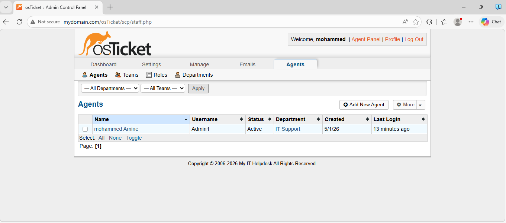
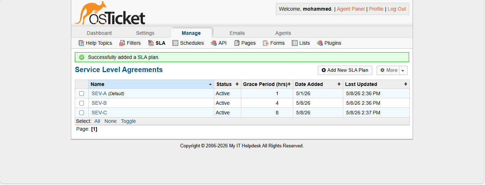
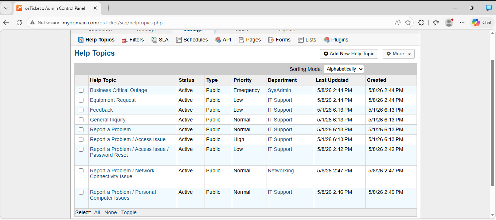
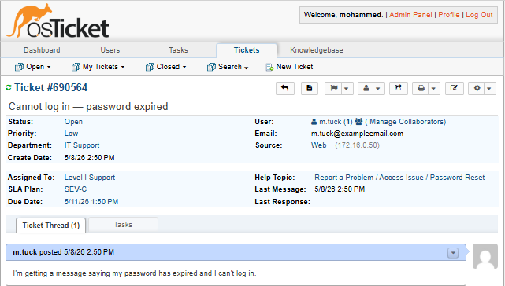
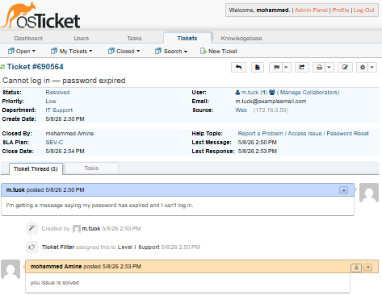

# Help Desk Operations (osTicket ITSM)

This section documents how I deployed and configured osTicket to simulate
a real enterprise IT Service Management (ITSM) workflow , from ticket
submission to resolution.

---

## What is osTicket and Why It Matters

osTicket is an open-source ticketing system used by real IT departments worldwide.
It manages the full lifecycle of a support request:

`User reports issue → Ticket created → Assigned to technician → Resolved → Closed`

Every professional IT environment uses *some* form of ticketing system
(ServiceNow, Jira, Zendesk, Freshdesk). Knowing how to work within one
is a baseline expectation for any help desk role.

---

## Environment

| Component | Details |
|---|---|
| osTicket Version | v1.18.3 |
| Hosted On | Windows Server 2022 (the Domain Controller) |
| Access URL | http://172.16.0.1/osticket |
| Web Server | IIS (Internet Information Services) |
| Database | MySQL |

---

## Step 1 - Installing osTicket on the Server

Installing osTicket required first enabling IIS on the server through
Server Manager → Add Roles → Web Server (IIS). Then I installed PHP,
MySQL, and the osTicket files. The trickiest part was configuring the
PHP extensions that osTicket requires .( I had to enable several in the
php.ini file manually.)

**Prerequisites I installed before osTicket:**
- IIS (Web Server role via Server Manager)
- PHP
- MySQL
- Required PHP extensions: `php_imap.dll`, `php_intl.dll`, `php_opcache.dll`

## Step 2 - Configuring the Help Desk Structure

Before tickets can be routed correctly, I set up the organizational structure
of the help desk inside osTicket's admin panel.

### Departments

Departments determine which team handles which tickets.

| Department | Purpose |
|---|---|
| IT Support | General technical issues, password resets |
| Networking | Connectivity and infrastructure issues |
| SysAdmin | Server-level and AD-related issues |

I kept it simple with two departments: Level 1 Support for basic issues
and SysAdmin for anything requiring server or AD access.

### Agents (Technicians)

| Agent | Department | Role |
|---|---|---|
| Mohammed Boudieb | IT Support | Admin |

**Screenshot : osTicket Admin Panel → Agents:**

## Step 3 - SLA (Service Level Agreement) Configuration

SLAs define how quickly tickets must be resolved based on severity.
In real IT departments, missing SLAs has business and contractual consequences.

| SLA Plan | Grace Period | Schedule | Used For |
|---|---|---|---|
| SEV-A (Critical) | 1 hour | 24/7 | System outages, security incidents |
| SEV-B (High) | 4 hours | 24/7 | Multiple users affected |
| SEV-C (Low) | 8 hours | Business hours | Single user, non-urgent issues |

I created three SLA plans in Admin Panel → Manage → SLA Plans.
SEV-A is set to 1 hour with 24/7 coverage because a system outage
affecting everyone can't wait until business hours.

**Screenshot : SLA Plans configured in osTicket:**

## Step 4 - Help Topics (Ticket Categories)

Help Topics are what end users select when submitting a ticket.
They determine automatic routing and SLA assignment.

| Help Topic | Auto-Assigned Department | Auto-Assigned SLA |
|---|---|---|
| Business Critical Outage | SysAdmin | SEV-A |
| Password Reset | IT Support | SEV-C |
| Equipment Request | IT Support | SEV-C |
| Personal Computer Issues | IT Support | SEV-B |
| Network Connectivity Issue | Networking | SEV-B |

**Screenshot : Help Topics in osTicket:**

## Step 5 - The Ticket Lifecycle (End-to-End Example)

Here is a complete example of a ticket flowing through the system:

### Ticket: User Cannot Log In After Password Expiry

**1. Submission**
A user tries to log into their workstation and gets a "password expired" message.
They navigate to `http://172.16.0.1/osticket` and submit a ticket:
- Help Topic: Password Reset
- Subject: "Cannot log in — password expired"
- Message: "I'm getting a message saying my password has expired and I can't log in."

**2. Triage**
Ticket auto-assigned to IT Support department with SEV-C SLA (8 hours to resolve).

**3. Investigation**

I opened the ticket, checked the user's account in AD Users and Computers.
Confirmed the password had expired. Checked account was not locked.

**4. Resolution**

Reset the password in AD to a temporary value and checked
'User must change password at next logon'. Communicated
the temporary password to the user via the ticket reply.

**5. Closure**

Ticket marked Resolved with full resolution notes documented.
Closed after user confirms they can log in.

**Screenshot : Example ticket open in osTicket:**

**Screenshot : Ticket resolved with notes:**

---

## What This Demonstrates

- **ITSM platform administration** — deploying and configuring a ticketing system
- **SLA management** — defining and applying severity-based response targets  
- **Ticket lifecycle management** — triage, assignment, resolution, closure
- **Documentation discipline** — logging actions taken inside each ticket
- **Help desk workflow** — mirrors real Tier 1 / Tier 2 support operations
